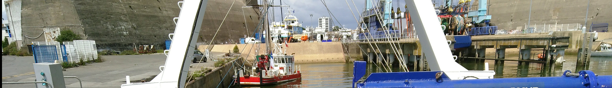

.. diyoceanbzh documentation master file, created
   from pynsitu doc on 16/04/2024

.. include:: why-DIY-Oceanography-BZH.rst

------------------------------------------------------------------

Covered sections
=================

.. panels::
   :container: container-lg pb-3
   :column: col-lg-4 col-md-4 col-sm-6 col-xs-12 p-2
   :body: text-dark dark:text-light

   ---
   :header: bg-primary text-center text-light
   
   **Contributions**
   ^^^
   Learn how to contribute to this project and join our community
   +++
   .. link-button:: contributor_guide
      :type: ref
      :text: Contribution Guides
      :classes: btn-outline-primary btn-block

   ---
   :header: bg-primary text-center text-white
   
   **Variables & Sensors**
   ^^^
   Explore different oceanographic variables and measurement techniques:

   * :doc:`Temperature </temperature/temperature>`
   * :doc:`Conductivity </conductivity/conductivity>`
   * :doc:`Turbidity </turbidity/turbidity>`
   * :doc:`Oxygen </oxygen/oxygen>`
   * :doc:`Fluorescence </fluorescence/fluorescence>`
   * :doc:`Currents </currents/currents>`
   * :doc:`Geopositioning </Geopositioning/geopositioning>`

   ---
   :header: bg-primary text-center text-white
   
   **Tools & Resources**
   ^^^
   Access helpful tools and resources:

   * :doc:`DIY Instruments </diy_instru/diy_instru>`
   * :doc:`Metrology </metrology/metrology>`
   * :doc:`Bibliography </bibliographie/bibliographie>`

------------------------------------------------------------------

.. include:: whats-new.rst

------------------------------------------------------------------
.. Feedback & contributor Guides
.. ----------------------------
.. toctree:: 
   :hidden:
   contributor_guide

.. Variables & sensors
.. -------------------

.. toctree:: 
   :hidden:
   :maxdepth: 1
   :caption: Variables & sensors

   temperature/temperature
   conductivity/conductivity
   turbidity/turbidity
   oxygen/oxygen
   fluorescence/fluorescence
   currents/currents
   Geopositioning/geopositioning

.. Tools
.. -----
.. toctree:: 
   :hidden:
   :maxdepth: 1
   :caption: DIY instruments & Tools

   diy_instru/diy_instru
   metrology/metrology
   bibliographie/bibliographie

